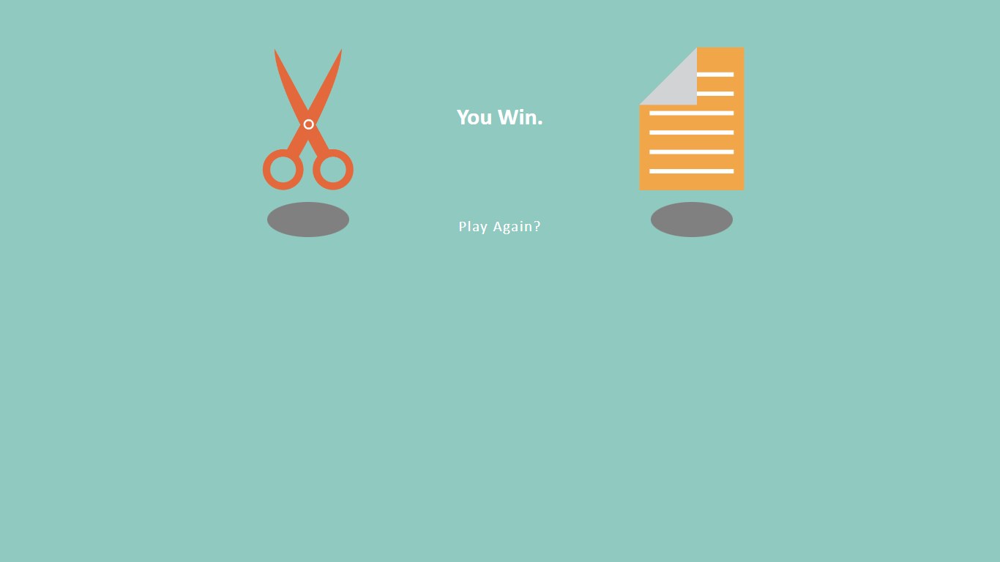

# 
rock-paper-scissors

> Rock, paper, scissors (also known as Rochambeau, Roshambo, or Janken) is a fun and easy hand game that anyone can learn and enjoy. It’s a great way to make minor decisions when you and a friend can’t agree on something, or even just an entertaining way to pass the time. The neat thing about the game is that almost anybody can pick the rules up in a matter of seconds. In this article, we’ll break the game down so that you and a friend can play whenever you’d like.

